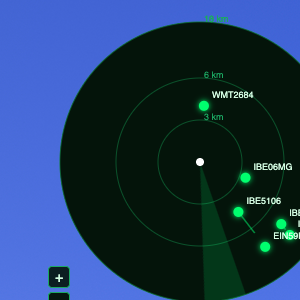

# Flight Radar Widget

Widget de escritorio para macOS que muestra en vivo los aviones cercanos a una ubicación configurable (por defecto, el aeropuerto de Barajas, Madrid), usando la [REST API de OpenSky Network](https://openskynetwork.github.io/opensky-api/rest.html).

Construido con Electron + Vite + React (`electron-vite`).



## Qué hace

- Se fija al escritorio (detrás de las ventanas, encima del wallpaper), es arrastrable y persiste su posición entre reinicios.
- Arranca solo al iniciar sesión en macOS (activable/desactivable desde el tray).
- Radar circular con anillos de distancia, estela histórica por avión, callsign visible, aeropuertos cercanos marcados, filtro de aviones en tierra y 3 niveles de zoom (3/6/10 km, 6/12/18 km, 10/20/30 km).
- Panel de configuración (engranaje en el radar, o "Configuración" en el tray) para ajustar ubicación central, radio de consulta e intervalo de polling, sin reiniciar la app.
- Las credenciales OpenSky se piden una sola vez (pantalla de onboarding en el primer arranque) y se guardan de forma segura fuera del bundle — nunca se leen de vuelta desde la interfaz.

## Uso en desarrollo

1. Instala dependencias:

   ```bash
   npm install
   ```

2. (Opcional) Copia `.env.example` a `.env` y completa tus credenciales OAuth2 de OpenSky y tu ubicación:

   ```bash
   cp .env.example .env
   ```

   Esto es solo un atajo de desarrollo: si no existe `.env`, el widget arranca igual con valores por defecto (Barajas) y pide las credenciales por pantalla. El `.env` nunca se versiona (ver `.gitignore`).

3. Arranca en modo desarrollo:

   ```bash
   npm run dev
   ```

   **Nota de sandbox**: si tu entorno tiene `ELECTRON_RUN_AS_NODE=1` seteado (algunos sandboxes de agentes lo hacen), Electron arranca como Node plano en vez de abrir la ventana. Arrancá con esa variable desactivada:

   ```bash
   env -u ELECTRON_RUN_AS_NODE npm run dev
   ```

4. `npm run build` genera el build de producción (`electron-vite build`, sin empaquetar) en `out/`.

## Obtener credenciales de OpenSky

1. Creá una cuenta gratuita en [opensky-network.org](https://opensky-network.org/).
2. En tu perfil, generá un cliente OAuth2 (client ID + client secret) para la API REST.
3. Pegalos en la pantalla de onboarding del widget (o en `.env` si estás en desarrollo) — la app los valida contra `/states/all` al guardarlos.

## Empaquetado (`.app`/`.dmg` para macOS)

```bash
npm run dist
```

Esto corre `electron-vite build` y luego `electron-builder --mac`, generando un `.app` y un `.dmg` sin firma de código en `dist/` (carpeta git-ignored). Instalando ese `.app` en una Mac limpia (sin `.env` ni `credentials.json` previos):

1. Al primer arranque, el widget muestra una pantalla bloqueante pidiendo las credenciales OpenSky (no hay `.env` empaquetado, nunca lo hay).
2. Al guardarlas, se persisten en `credentials.json` bajo `~/Library/Application Support/flight-radar-widget/` (permisos `0o600`) y el radar arranca a mostrar vuelos.
3. La ubicación central, el radio de consulta y el intervalo de polling se configuran después desde el panel de ajustes (engranaje o tray); se guardan en `settings.json` en esa misma carpeta.
4. Ninguno de los dos archivos (`credentials.json`, `settings.json`) se incluye en el paquete — viven solo en la máquina donde se instala y ejecuta la app.

Para rotar las credenciales más adelante, usá la sección correspondiente del panel de configuración (los campos quedan siempre en blanco; dejarlos en blanco no cambia nada).

## Estructura

- `src/main/` — proceso principal de Electron: ventana (comportamiento de widget, posición persistida), tray, autenticación OAuth2 y polling de OpenSky (`opensky.ts`), credenciales (`credentials.ts`), configuración persistida (`settings.ts`, `config.ts`), posición de ventana (`windowState.ts`).
- `src/preload/` — script de preload (puente seguro `contextBridge` entre main y renderer; ningún canal permite leer credenciales de vuelta).
- `src/renderer/src/` — interfaz React: `Radar.tsx` (radar SVG), `SettingsPanel.tsx` (configuración), `CredentialsGate.tsx` (onboarding), `App.tsx` (orquestación).
- `src/shared/` — tipos y utilidades compartidas entre procesos (`geo.ts` para distancia/rumbo, `airports.ts` para aeródromos cercanos, `types.ts`).

## Seguridad

- Las credenciales de OpenSky (`client_id`/`client_secret`) se leen y se guardan únicamente en el proceso principal de Electron: nunca se exponen al renderer ni a devtools, y no existe ningún canal IPC que permita leerlas de vuelta una vez guardadas.
- En desarrollo pueden vivir en `.env` (git-ignored); en una build empaquetada se piden por pantalla y se persisten en `credentials.json` fuera del árbol del proyecto.
- `settings.json` (ubicación, radio, intervalo de polling) es configuración de usuario, no un secreto, y vive separado de las credenciales.
